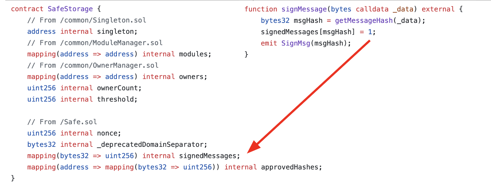

# halo2-storage-proof

## Why

Verifying storage proofs within a ZK circuit allows proving a specific block's state without leaking anything about the proved value, i.e. 

- neither its storage location (which contract) 
- nor its storage entry (what value)

## Example

The screenshot below illustrates the storage mapping holding all messages that have been confirmed by at least `$threshold` signers. Generating a zk storage proof of such mapping value allows hooking into the Safe multisig mechanism without creating a direct link as it would be the case with e.g. ERC-1271 callbacks.

**Safe storage**



## Dev

```sh
node ./server/main.js
```

Start the proving server

---

```sh
curl http://localhost:3000/getStorageProof?masterSafeAddress=0x123&msgHash=0xabc
```

Fetch a zk storage proof from the server

---

```sh
RUST_LOG=info cargo run --release
```

Generate a zk storage proof

## WIP

This is a quite hacky, incomplete, and unoptimized implementation. There are a lot of optimizations to be done with regard to `halo2-lib` parameter tuning. Moreover, the generated Solidity `Halo2Verifier` exceeds EIP-170's max code size of 24KiB - we'll be looking into code splitting techniques.

## Credits

- Axiom team
- PSE team
- zkEmail team

## License 

MIT